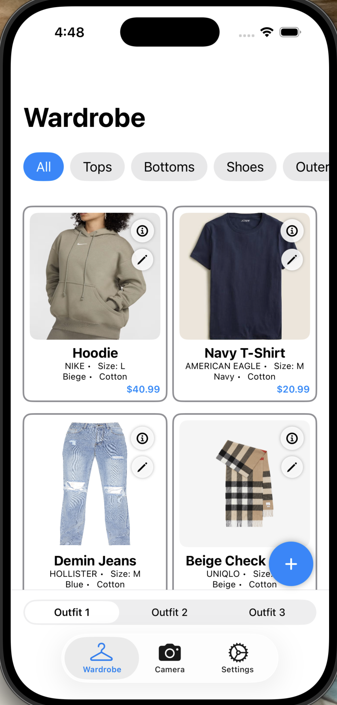

# SmartFit - Overview & MVP

SmartFit is a mobile iOS application that enables college students to virtually manage and style their wardrobe and try on clothing items using their smartphone camera before making online purchases.

### Value Proposition
How does this MVP add value to the user, how is it better than their current alternatives. When comparing to google's version of clothing fit check, Doppl, we noticed that you were forced to upload the entire outfit at once in a top/down picture format.
This means that their algorithm is only able to detect clothes if you submit a picture of:

- An full body image of someone wearing an outfit and Doppl will recognize the clothes they are wearing and equip it onto your model.
- An image where the tops (shirt/jacket/etc) is directly above the bottoms (pants/shorts/etc)

Doppl lacks a wardrobe feature since they only have suggested outfits that are pre-registered and only WHOLE outfit uploads, so mixing and matching different tops/bottoms are difficult.
[Doppl] (https://labs.google/doppl)

### Solution

SmartFit provides a **virtual wardrobe + outfit builder**:

- Store real-world clothing items digitally with a photo + metadata
- Filter by category (tops, bottoms, shoes, accessories, etc.)
- Build outfits using three outfit slots (Outfit 1–3)
- Quickly see which items are equipped in the current outfit

### MVP Description

Our MVP focuses on delivering a **functional virtual wardrobe** backed by a real database:

- Users can:
  - Upload a clothing item manually or via link
    - (Manual) Enter details: name, brand, size, color, material, price.
    - (Link) Enter url link of a clothing item.
  - Save items to a database and viewed within their personal virtual wardrobe.
- Users can:
  - View items by category
  - Equip one item per category into **Outfit 1–3**
- Additional features:
  - Allows user to upload a clothing item via:
    - **Manual Entry** (add item form)
    - **Import from URL** (in-progress flow)

## Architecture Overview

**Frontend (iOS)**

- Swift / SwiftUI
- PhotosUI for image selection
- REST API calls to the backend using URLSession

**Backend**

- Node.js + Express
- MongoDB via Mongoose
- Jest for tests
- ESLint + Prettier for code quality

**DevOps / Tooling**

- GitHub Actions workflows for:
  - Backend CI (lint + tests)
  - iOS build/test checks

**Testing Framework & Execution**
- Jest for backend (configuration file present)
**Code Quality Tools**
**Backend**
- npm run lint (esLint)
- npm run format (prettier)
**FrontEnd**
- brew install swiftlint (Install brew first if not already)
- swiftlint lint --quiet

### Application view

[Video Demo]()

### Setup Instructions

1. Clone repository onto xCode
2. Click on smartfit on the top of right bar (not the folder but above it)
3. Click on SmartFit under "Targets" and open "Signing and Capabilities" to sign with your apple ID
4. If not already set, set the bundle identifier to "edwin.SmartFit"
5. On the very top bar of Xcode, select which device you want to run.
- If paired with physical iphone device, please connect it via cord
6. Product -> Clean Build Folder (Shift + Command + K) 
7. Manually press the right arrow, or Product -> Run (Command + R)

**Testing Instructions**
- Backend
1. Clone repository to local device
2. cd into backend
3. Run command 'npm ci', then 'npm test'

- Frontend
**Please use xCode for easier testing**
1. Clone repository to xCode
2. Product -> Clean Build Folder (Shift + Command + K) 
3. Open 'Test Navigator' (Icon on right in horizontal bar with a check mark in a square)
4. Press run on any test

**Linting Instructions**
- Backend 
1. Clone repository to local device
2. cd into backend
3. Run command 'npm ci', then 'npm run lint'

-Frontend
1. Clone repository to local device
2. cd into SmartFit
3. brew install swiftlint
4. run command 'swiftlint lint --quiet --config .swiftlint.yml'

### Links

**Burn Chart**
[Burn Chart Sprint 1] (https://github.com/users/yu-edwin/projects/1/insights/2)
[Burn Chart Sprint 2] (https://github.com/users/yu-edwin/projects/1/insights/4?period=3M)
[Burn Chart Sprint 3] (https://github.com/users/yu-edwin/projects/1/insights/3)
[Burn Chart Sprint 4] (https://github.com/users/yu-edwin/projects/1/insights/5?period=1M)

**CI/CD Pipeline**
[View CI Workflow](https://github.com/yu-edwin/SmartFit/actions)

**Project Board**
[Project Board] (https://github.com/users/yu-edwin/projects/1/views/1)

**Deployement Link**
Note: Camera is not viewable in appetize
[Appetize Link] (https://appetize.io/app/b_ljtpxdj664c3c667twqr6hj2ke)
